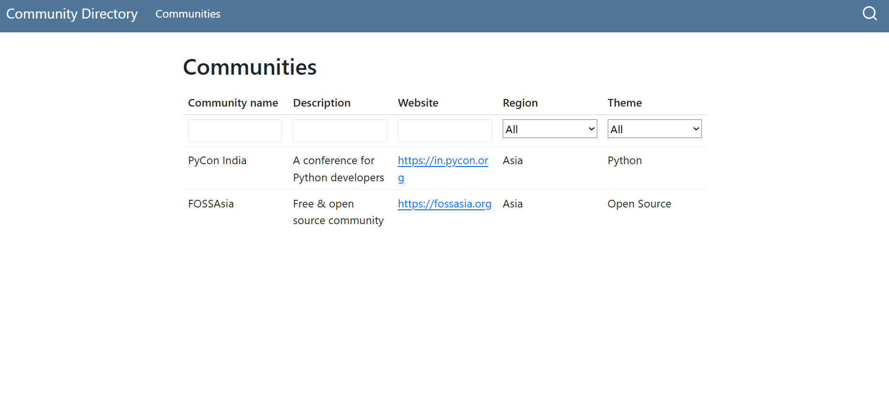

```bash
community-directory/
├── .github/
│   └── workflows/
│       └── render-quarto.yml       <-- GitHub Action
├── communities.csv                 <-- Editable by contributors
├── communities.qmd                 <-- Main Quarto page
├── _quarto.yml                     <-- Quarto config
├── README.md
└── docs/                           <-- Will hold rendered HTML for GitHub Pages
```

# 🌍 Community Directory

This site lists tech communities around the world in a filterable table.

- You can contribute new entries to [`communities.csv`](./communities.csv)
- The site is rendered via [Quarto](https://quarto.org/) and hosted with GitHub Pages.

## ✅ Contributing

Follow these steps to contribute:

1. **Fork the repository**: Click the "Fork" button on the repository page.
2. **Update `communities.csv`**: Add your community details to the file.
3. **Open a pull request**: Submit your changes for review.

### Preview Your Changes

Ensure your updates look correct by previewing the site locally:

1. Install [Quarto](https://quarto.org/docs/get-started/).
2. Run the following command in the repository root:

    ```bash
    quarto preview
    ```

3. Open the provided local URL in your browser to view the site.

Alternatively, navigate to the `docs/` folder and open the rendered HTML files directly.


```
